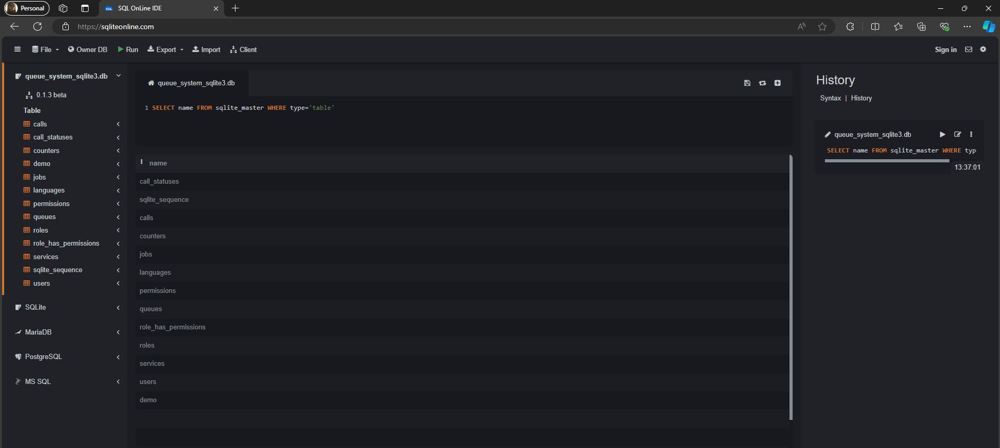

## Section A: Initialization

### 1. Sample Data -> Restore
#### SQL Query

```
SELECT name FROM sqlite_master WHERE type='table'
```
#### OUTPUT


### 2. Tables Definition and Their Relation
**Tables**
1. **calls**
    ```
    PRAGMA table_info(calls)
    ```
   - `id` (INTEGER) - Primary Key, auto_increment
   - `queue_id` (INTEGER) - Foreign Key referencing `queues(id)`
   - `service_id` (INTEGER) - Foreign Key referencing `services(id)`
   - `counter_id` (INTEGER) - Foreign Key referencing `counters(id)`
   - `user_id` (INTEGER) - Foreign Key referencing `users(id)`
   - `token_letter` (varchar(191)) - Token letter
   - `token_number` (INTEGER) - Token number
   - `called_date` (date) - Date when the call was made
   - `started_at` (datetime) - Timestamp when the call started, defaults to current timestamp
   - `ended_at` (datetime) - Timestamp when the call ended
   - `waiting_time` (time) - Time spent waiting
   - `served_time` (time) - Time spent being served
   - `turn_around_time` (time) - Total turnaround time
   - `created_at` (timestamp) - Timestamp when the call was created
   - `updated_at` (timestamp) - Timestamp when the call was last updated
   - `call_status_id` (INTEGER) - Foreign Key referencing `call_statuses(id)`

2. **call_statuses**
    ```
    PRAGMA table_info(call_statuses)
    ```
   - `id` (INTEGER) - Primary Key, auto_increment
   - `name` (varchar(191)) - Name of the call status
   - `created_at` (timestamp) - Timestamp when the call status was created
   - `updated_at` (timestamp) - Timestamp when the call status was last updated

3. **counters**
    ```
    PRAGMA table_info(counters)
    ```
   - `id` (INTEGER) - Primary Key, auto_increment
   - `name` (varchar(191)) - Name of the counter
   - `status` (INTEGER) - Status of the counter
   - `created_at` (timestamp) - Timestamp when the counter was created
   - `updated_at` (timestamp) - Timestamp when the counter was last updated

4. **demo**
    ```
    PRAGMA table_info(demo)
    ```
   - `ID` (INTEGER) - Primary Key, auto_increment
   - `Name` (varchar(20)) - Name of the demo
   - `Hint` (TEXT) - Hint text

5. **jobs**
    ```
    PRAGMA table_info(jobs)
    ```
   - `id` (INTEGER) - Primary Key, auto_increment
   - `queue` (varchar(191)) - Name of the queue
   - `payload` (longtext) - Job payload
   - `attempts` (INTEGER) - Number of attempts
   - `reserved_at` (INTEGER) - Timestamp when the job was reserved
   - `available_at` (INTEGER) - Timestamp when the job becomes available
   - `created_at` (INTEGER) - Timestamp when the job was created

6. **languages**
    ```
    PRAGMA table_info(languages)
    ```
   - `id` (INTEGER) - Primary Key, auto_increment
   - `code` (varchar(191)) - Code of the language
   - `name` (varchar(191)) - Name of the language
   - `display` (varchar(191)) - Display name of the language
   - `image` (varchar(191)) - Image associated with the language
   - `created_at` (timestamp) - Timestamp when the language was created
   - `updated_at` (timestamp) - Timestamp when the language was last updated
   - `token_translation` (varchar(191)) - Translation of the token
   - `please_proceed_to_translation` (varchar(191)) - Translation of the phrase "please proceed to"

7. **permissions**
    ```
    PRAGMA table_info(permissions)
    ```
   - `id` (INTEGER) - Primary Key, auto_increment
   - `name` (varchar(191)) - Name of the permission
   - `guard_name` (varchar(191)) - Guard name for the permission
   - `created_at` (timestamp) - Timestamp when the permission was created
   - `updated_at` (timestamp) - Timestamp when the permission was last updated

8. **queues**
    ```
    PRAGMA table_info(queues)
    ```
   - `id` (INTEGER) - Primary Key, auto_increment
   - `service_id` (INTEGER) - Foreign Key referencing `services(id)`
   - `number` (INTEGER) - Queue number
   - `called` (INTEGER) - Indicator if the queue has been called
   - `reference_no` (varchar(191)) - Reference number for the queue
   - `letter` (varchar(191)) - Letter associated with the queue
   - `name` (varchar(191)) - Name of the person in the queue
   - `email` (varchar(191)) - Email of the person in the queue
   - `phone` (varchar(191)) - Phone number of the person in the queue
   - `position` (INTEGER) - Position in the queue
   - `created_at` (timestamp) - Timestamp when the queue was created
   - `updated_at` (timestamp) - Timestamp when the queue was last updated

9. **roles**
    ```
    PRAGMA table_info(roles)
    ```
    - `id` (INTEGER) - Primary Key, auto_increment
    - `name` (varchar(191)) - Name of the role
    - `guard_name` (varchar(191)) - Name of the guard associated with the role
    - `created_at` (timestamp) - Timestamp when the role was created
    - `updated_at` (timestamp) - Timestamp when the role was last updated

10. **role_has_permissions**
    ```
    PRAGMA table_info(role_has_permissions)
    ```
    - `permission_id` (INTEGER) - Foreign Key referencing `permissions(id)`
    - `role_id` (INTEGER) - Foreign Key referencing `roles(id)`

11. **services**
    ```
    PRAGMA table_info(services)
    ```
    - `id` (INTEGER) - Primary Key, auto_increment
    - `name` (varchar(191)) - Name of the service
    - `letter` (varchar(191)) - Letter associated with the service
    - `start_number` (INTEGER) - Starting number for the service
    - `status` (INTEGER) - Status of the service
    - `sms_enabled` (INTEGER) - Indicator if SMS notifications are enabled
    - `optin_message_enabled` (INTEGER) - Indicator if opt-in messages are enabled
    - `call_message_enabled` (INTEGER) - Indicator if call messages are enabled
    - `noshow_message_enabled` (INTEGER) - Indicator if no-show messages are enabled
    - `completed_message_enabled` (INTEGER) - Indicator if completed messages are enabled
    - `status_message_enabled` (INTEGER) - Indicator if status messages are enabled
    - `optin_message_format` (varchar(191)) - Format for opt-in messages
    - `call_message_format` (varchar(191)) - Format for call messages
    - `noshow_message_format` (varchar(191)) - Format for no-show messages
    - `completed_message_format` (varchar(191)) - Format for completed messages
    - `status_message_format` (varchar(191)) - Format for status messages
    - `status_message_positions` (varchar(191)) - Positions for status messages
    - `ask_name` (INTEGER) - Indicator if name is asked
    - `name_required` (INTEGER) - Indicator if name is required
    - `ask_email` (INTEGER) - Indicator if email is asked
    - `email_required` (INTEGER) - Indicator if email is required
    - `ask_phone` (INTEGER) - Indicator if phone is asked
    - `phone_required` (INTEGER) - Indicator if phone is required
    - `created_at` (timestamp) - Timestamp when the service was created
    - `updated_at` (timestamp) - Timestamp when the service was last updated

12. **sqlite_sequence**
    ```
    PRAGMA table_info(sqlite_sequence)
    ```
    - `name` () - Name of the sequence
    - `seq` () - Sequence value   

13. **users**
    ```
    PRAGMA table_info(users)
    ```
    - `id` (INTEGER) - Primary Key, auto_increment
    - `name` (varchar(191)) - Name of the user
    - `email` (varchar(191)) - Email address of the user
    - `email_verified_at` (timestamp) - Timestamp when the email was verified
    - `password` (varchar(191)) - Password of the user
    - `remember_token` (varchar(100)) - Token used for remembering the user
    - `created_at` (timestamp) - Timestamp when the user was created
    - `updated_at` (timestamp) - Timestamp when the user was last updated
    - `image` (varchar(191)) - Image associated with the user

**Relationships:**
```
PRAGMA foreign_key_list(calls)
```
- **calls & users:** Linked by `user_id` in the `calls` table referencing `users(id)`.
- **calls & services:** Linked by `service_id` in the `calls` table referencing `services(id)`.
- **calls & queues:** Linked by `queue_id` in the `calls` table referencing `queues(id)`.
- **calls & counters:** Linked by `counter_id` in the `calls` table referencing `counters(id)`.
- **calls & call_statuses:** Linked by `call_status_id` in the `calls` table referencing `call_statuses(id)`.
```
PRAGMA foreign_key_list(queues)
```
- **queues & services:** Linked by `service_id` in the `queues` table referencing `services(id)`
```
PRAGMA foreign_key_list(role_has_permissions)
```
- **role_has_permissions & roles:** Linked by `role_id` in the `role_has_permissions` table referencing `roles(id)`
- **role_has_permissions & permissions:** Linked by `permission_id` in the `role_has_permissions` table referencing `permissions(id)`