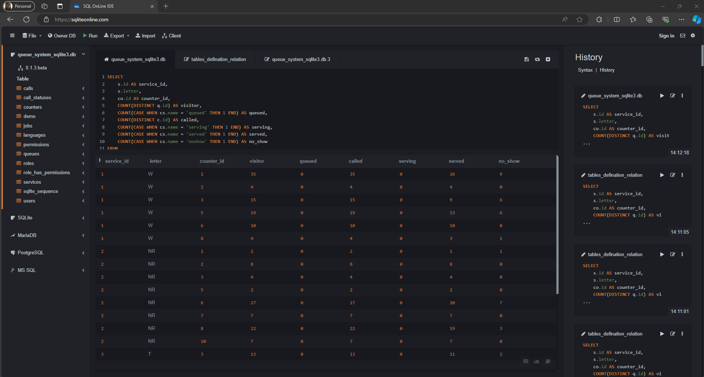

## Section B: Query Building

### 3. Counter Summary
#### SQL Query
```
SELECT
    co.id AS counter_id,
    MAX(CASE WHEN cs.name = 'serving' THEN c.token_letter || c.token_number ELSE NULL END) AS serving_token,
    COUNT(CASE WHEN c.id then 1 ELSE NULL end) as called,
    COUNT(CASE WHEN cs.name = 'serving' THEN 1 END) AS serving,
    COUNT(CASE WHEN cs.name = 'served' THEN 1 END) AS served,
    COUNT(CASE WHEN cs.name = 'noshow' THEN 1 END) AS no_show
FROM
    counters co
LEFT JOIN calls c ON co.id = c.counter_id 
LEFT JOIN queues q ON c.queue_id = q.id
LEFT JOIN call_statuses cs ON c.call_status_id = cs.id
WHERE
    DATE(c.created_at) = '2024-02-14'
GROUP BY
    co.id
ORDER BY
    co.id;
```

#### OUTPUT


### 4. Service Summary
#### SQL Query
```
SELECT 
    s.id AS service_id,
    s.letter,
    COUNT(DISTINCT q.id) AS visitor,
    COUNT(CASE WHEN cs.name = 'queued' THEN 1 END) AS queued,
    COUNT(DISTINCT c.id) AS called,
    COUNT(CASE WHEN cs.name = 'serving' THEN 1 END) AS serving,
    COUNT(CASE WHEN cs.name = 'served' THEN 1 END) AS served,
    COUNT(CASE WHEN cs.name = 'noshow' THEN 1 END) AS no_show
FROM 
    services s
LEFT JOIN queues q ON s.id = q.service_id 
LEFT JOIN calls c ON q.id = c.queue_id
LEFT JOIN call_statuses cs ON c.call_status_id = cs.id
WHERE
	DATE(q.created_at) = '2024-02-14'
GROUP BY 
    s.id;
```

#### OUTPUT


### 5. Service x Counter Summary
#### SQL Query
```
SELECT
    s.id AS service_id,
    s.letter,
    co.id AS counter_id,
    COUNT(DISTINCT q.id) AS visitor,
    COUNT(CASE WHEN cs.name = 'queued' THEN 1 END) AS queued,
    COUNT(DISTINCT c.id) AS called,
    COUNT(CASE WHEN cs.name = 'serving' THEN 1 END) AS serving,
    COUNT(CASE WHEN cs.name = 'served' THEN 1 END) AS served,
    COUNT(CASE WHEN cs.name = 'noshow' THEN 1 END) AS no_show
FROM
    services s
LEFT JOIN queues q ON s.id = q.service_id
LEFT JOIN calls c ON q.id = c.queue_id
LEFT JOIN counters co ON c.counter_id = co.id
LEFT JOIN call_statuses cs ON c.call_status_id = cs.id
WHERE
    DATE(c.created_at) = '2024-02-14'
GROUP BY
    s.id, s.letter, co.id
ORDER BY
    s.id, co.id;
```

#### OUTPUT



### 5. Agent Summary
#### SQL Query
```
SELECT
    u.name,
    s.letter,
    COUNT(DISTINCT q.id) AS visitor,
    COUNT(CASE WHEN cs.name = 'queued' THEN 1 END) AS queued,
    COUNT(DISTINCT c.id) AS called,
    COUNT(CASE WHEN cs.name = 'serving' THEN 1 END) AS serving,
    COUNT(CASE WHEN cs.name = 'served' THEN 1 END) AS served
FROM
    users u
LEFT JOIN calls c ON u.id = c.user_id
LEFT JOIN queues q ON c.queue_id = q.id
LEFT JOIN services s ON q.service_id = s.id
LEFT JOIN call_statuses cs ON c.call_status_id = cs.id
WHERE
    DATE(c.created_at) = '2024-02-14'
GROUP BY
    u.name, s.letter
ORDER BY
    u.name, s.letter;
```

#### OUTPUT

